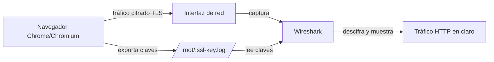

# 🦈 Interceptación y descifrado de tráfico TLS/SSL con Wireshark

> Guía práctica para capturar y descifrar tráfico HTTPS (TLS/SSL) generado por Google Chrome / Chromium usando **Wireshark** y la variable de entorno `SSLKEYLOGFILE`.

[](https://www.wireshark.org/)
[]()
[]()

---

## 📑 Tabla de contenidos

1. [¿Qué es esto?](#-qué-es-esto)
2. [¿Cómo funciona?](#-cómo-funciona)
3. [Requisitos](#-requisitos)
4. [Instalación](#-instalación)
5. [Guía paso a paso](#-guía-paso-a-paso)
6. [Configuración de Wireshark](#-configuración-de-wireshark)
7. [Filtros útiles en Wireshark](#-filtros-útiles-en-wireshark)
8. [Script auxiliar: hex.sh](#-script-auxiliar-hexsh)
9. [Extensión de navegador: HTTP Header Live](#-extensión-de-navegador-http-header-live)
10. [Resumen de variables y rutas](#-resumen-de-variables-y-rutas)
11. [Solución de problemas](#-solución-de-problemas)
12. [Buenas prácticas y advertencias legales](#-buenas-prácticas-y-advertencias-legales)
13. [Recursos y enlaces](#-recursos-y-enlaces)

---

## 🎯 ¿Qué es esto?

Este repositorio explica cómo **descifrar tráfico TLS/SSL propio** (por ejemplo, el generado por tu navegador Chrome/Chromium) directamente en Wireshark, sin necesidad de certificados falsos ni de un proxy MITM (Man-in-the-Middle).

Se apoya en una característica que incorporan los navegadores basados en Chromium (y también Firefox) para depuración: la posibilidad de **volcar las claves de sesión TLS a un fichero de texto** mediante la variable de entorno `SSLKEYLOGFILE`. Wireshark puede leer ese fichero y usar las claves para descifrar los paquetes capturados en tiempo real.

| Aspecto | Detalle |
|---|---|
| **Objetivo** | Descifrar tráfico TLS/SSL propio para análisis, depuración o aprendizaje |
| **Herramienta principal** | Wireshark 4.2.4 (o superior) |
| **Navegador soportado** | Chrome / Chromium (también aplicable a Firefox) |
| **Mecanismo** | Variable `SSLKEYLOGFILE` + fichero de log de claves |
| **Requiere modificar el navegador** | No |
| **Requiere certificados falsos / proxy MITM** | No |
| **Alcance del descifrado** | Solo el tráfico generado por el proceso que exporta las claves (el propio navegador del usuario) |

---

## 🧠 ¿Cómo funciona?

Cuando se establece una conexión TLS, el cliente y el servidor negocian una serie de claves de sesión efímeras a partir de una **Pre-Master Key** (o claves derivadas, según la versión de TLS). Estas claves son las que realmente cifran los datos de la sesión.

Muchas aplicaciones basadas en **NSS (Network Security Services)** o en **BoringSSL/OpenSSL con soporte para logging de claves** —como Chrome, Chromium y Firefox— pueden volcar esas claves de sesión a un fichero de texto plano si detectan la variable de entorno `SSLKEYLOGFILE` apuntando a una ruta válida.

Wireshark entiende ese formato (`NSS Key Log Format`) y, si se le indica la ruta del fichero en sus preferencias del protocolo SSL/TLS, puede usar esas claves para **descifrar en vivo** los paquetes TLS capturados, mostrando el contenido en claro (HTTP, JSON, etc.) en el panel de inspección.



> ⚠️ Esta técnica **no rompe** el cifrado TLS ni explota ninguna vulnerabilidad criptográfica: simplemente utiliza las claves de sesión que el propio proceso legítimo ya conoce y decide compartir con fines de depuración.

---

## ✅ Requisitos

| Requisito | Descripción |
|---|---|
| **Sistema operativo** | Linux (probado en distribuciones tipo Debian/Ubuntu/Kali) |
| **Wireshark** | Versión 4.2.4 o superior instalada |
| **Chromium / Google Chrome** | Instalado y accesible desde terminal |
| **Permisos** | Acceso de superusuario (`root`) o permisos suficientes para capturar en la interfaz de red y escribir en el fichero de log |
| **Shell** | Bash |
| **Utilidades opcionales** | `xxd`, `sed` (usadas por `hex.sh`) |

---

## ⚙️ Instalación

### 1. Instalar Wireshark

```bash
sudo apt update
sudo apt install wireshark -y
```

Durante la instalación en Debian/Ubuntu, se preguntará si se desea permitir capturar paquetes a usuarios no root; para un uso más cómodo puede aceptarse, aunque en esta guía se trabaja como `root`.

### 2. Instalar Chromium (si no está instalado)

```bash
sudo apt install chromium -y
```

### 3. Clonar este repositorio

```bash
git clone https://github.com/hackingyseguridad/wireshark.git
cd wireshark
```

---

## 🚀 Guía paso a paso

### Paso 1 — Configurar la variable `SSLKEYLOGFILE` de forma persistente

Edita el fichero `.bashrc` de tu usuario (en este ejemplo, `root`) y añade al final la exportación de la variable:

```bash
echo "export SSLKEYLOGFILE=/root/.ssl-key.log" >> /root/.bashrc
```

Esto asegura que, cada vez que se abra una nueva sesión de terminal, la variable esté definida automáticamente.

### Paso 2 — Cargar la variable en la sesión actual

Si no quieres reiniciar la terminal, exporta la variable manualmente en la sesión activa:

```bash
export SSLKEYLOGFILE="/root/.ssl-key.log"
```

Verifica el usuario actual (opcional, útil para confirmar la ruta de `HOME`):

```bash
whoami
```

### Paso 3 — Lanzar Chromium apuntando al log de claves

Con la variable ya exportada en la misma terminal, lanza el navegador:

```bash
chromium --no-sandbox &
```

> El flag `--no-sandbox` suele ser necesario cuando se ejecuta Chromium como `root`, ya que por defecto el sandbox de Chromium rechaza ejecutarse con privilegios de superusuario.

A partir de este momento, cada vez que Chromium negocie una nueva sesión TLS, añadirá una línea con las claves correspondientes al fichero `/root/.ssl-key.log`.

### Paso 4 — Comprobar que se están generando claves

```bash
cat .ssl-key.log
```

Deberías ver líneas con un formato similar a:

```
CLIENT_RANDOM <64 hex chars> <96/98 hex chars>
```

### Paso 5 — Configurar Wireshark para leer el fichero de claves

Ver la sección [Configuración de Wireshark](#-configuración-de-wireshark).

### Paso 6 — Capturar e inspeccionar el tráfico

Lanza Wireshark, selecciona la interfaz de red correspondiente (por ejemplo, `eth0`, `wlan0` o `lo` según el caso) e inicia la captura mientras navegas con Chromium:

```bash
wireshark
```

Wireshark descifrará automáticamente los paquetes TLS a medida que reconozca las claves correspondientes en el log.

---

## 🔧 Configuración de Wireshark

Sigue esta ruta dentro de la interfaz gráfica de Wireshark:

```
Edit → Preferences → Protocols → TLS
```

> En versiones más antiguas de Wireshark este protocolo aparece como **SSL** en lugar de **TLS**.

En el campo:

```
(Pre)-Master-Secret log filename
```

introduce la ruta absoluta del fichero de claves:

```
/root/.ssl-key.log
```

| Campo en Wireshark | Valor de ejemplo |
|---|---|
| Ruta del menú | `Edit → Preferences → Protocols → TLS` (o `SSL` en versiones antiguas) |
| Campo a rellenar | `(Pre)-Master-Secret log filename` |
| Valor | `/root/.ssl-key.log` |
| Efecto | Descifrado automático del tráfico TLS capturado que coincida con las claves del log |

Tras aplicar los cambios, Wireshark releerá el fichero de claves de forma continua, por lo que no es necesario reiniciar la aplicación cada vez que se generen nuevas claves.

**Referencia oficial de Wireshark:** <https://www.wireshark.org/>

---

## 🔎 Filtros útiles en Wireshark

Una vez configurado el descifrado, estos filtros ayudan a localizar rápidamente el tráfico de interés:

| Filtro | Qué muestra |
|---|---|
| `tls` | Todo el tráfico TLS/SSL capturado |
| `tls.handshake.type == 1` | Paquetes *Client Hello* (inicio del handshake) |
| `tls.handshake.type == 2` | Paquetes *Server Hello* |
| `http` | Tráfico HTTP ya descifrado (tras aplicar la clave) |
| `http.request` | Peticiones HTTP realizadas por el navegador |
| `http.response` | Respuestas HTTP del servidor |
| `tls.record.content_type == 23` | Application Data (payload cifrado/descifrado de la sesión) |
| `ip.addr == <IP>` | Filtra por una dirección IP concreta (origen o destino) |
| `tcp.port == 443` | Tráfico en el puerto estándar de HTTPS |

---

## 🧩 Script auxiliar: `hex.sh`

El repositorio incluye una pequeña utilidad en Bash para convertir texto a formato hexadecimal, útil por ejemplo para comparar cadenas contra el contenido hexadecimal visible en Wireshark.

### Uso

```bash
sh hex.sh <texto>
```

Si se ejecuta sin argumentos, el script muestra su propia ayuda:

```bash
$ sh hex.sh
Convierte texto en formato hexadecimal
hackingyseguridad.com
Uso.: sh hex.sh <texto>
```

### Ejemplo

```bash
$ sh hex.sh hola
686f6c61
```

| Parámetro | Descripción |
|---|---|
| `<texto>` | Cadena de texto a convertir a hexadecimal |
| Herramienta interna | `xxd -c 256 -ps` seguido de un `sed` para limpiar el salto de línea final |
| Salida | Cadena hexadecimal continua, sin espacios ni saltos de línea |

---

## 🌐 Extensión de navegador: HTTP Header Live

Como complemento a la interceptación por Wireshark, el repositorio recomienda la extensión **HTTP Header Live**, disponible para Firefox, que permite inspeccionar en tiempo real las cabeceras HTTP de las peticiones y respuestas directamente desde el navegador.

- Enlace de descarga: <https://addons.mozilla.org/en-US/firefox/addon/http-header-live/>

| Herramienta | Función | Alcance |
|---|---|---|
| Wireshark + `SSLKEYLOGFILE` | Captura y descifrado a nivel de red (paquetes TLS) | Todo el tráfico de red del proceso |
| HTTP Header Live | Inspección de cabeceras HTTP a nivel de navegador | Solo peticiones realizadas por el propio navegador |

---

## 📋 Resumen de variables y rutas

| Elemento | Valor / Ruta | Propósito |
|---|---|---|
| Variable de entorno | `SSLKEYLOGFILE` | Indica al navegador dónde volcar las claves de sesión TLS |
| Fichero de claves | `/root/.ssl-key.log` | Almacena las claves `CLIENT_RANDOM` generadas en cada sesión TLS |
| Fichero de configuración de shell | `/root/.bashrc` | Persiste la variable `SSLKEYLOGFILE` entre sesiones |
| Preferencia en Wireshark | `Edit → Preferences → Protocols → TLS → (Pre)-Master-Secret log filename` | Indica a Wireshark dónde leer las claves para descifrar |
| Comando de lanzamiento del navegador | `chromium --no-sandbox &` | Ejecuta Chromium en segundo plano generando el log de claves |

---

## 🛠️ Solución de problemas

| Problema | Posible causa | Solución |
|---|---|---|
| El fichero `.ssl-key.log` está vacío | La variable `SSLKEYLOGFILE` no estaba exportada **antes** de lanzar el navegador | Exporta la variable en la misma terminal antes de ejecutar `chromium` |
| Wireshark no descifra el tráfico | Ruta incorrecta en las preferencias de TLS | Verifica que la ruta introducida en Wireshark coincide exactamente con la del fichero de log |
| Chromium no arranca como root | Sandbox de Chromium bloquea la ejecución con privilegios elevados | Usa el flag `--no-sandbox` (solo en entornos de laboratorio controlados) |
| No se ven paquetes en la interfaz | Interfaz de red incorrecta seleccionada en Wireshark | Selecciona la interfaz activa correspondiente a tu conexión (`eth0`, `wlan0`, etc.) |
| El navegador no reconoce la variable tras editar `.bashrc` | El `.bashrc` no se ha recargado en la sesión actual | Ejecuta `source ~/.bashrc` o abre una nueva terminal |
| Algunas conexiones no se descifran | Uso de TLS 1.3 con *Encrypted Client Hello* o certificate pinning en la app | Comprobar la versión de TLS negociada y si la aplicación implementa mecanismos adicionales de protección |

---

## ⚖️ Buenas prácticas y advertencias legales

- Esta técnica debe usarse **exclusivamente** sobre tráfico propio o en entornos de laboratorio/pruebas para los que se cuenta con autorización explícita.
- Interceptar o descifrar tráfico de **terceros sin su consentimiento** puede constituir un delito según la legislación aplicable en tu país (por ejemplo, normativa de protección de comunicaciones y datos personales).
- El fichero de claves (`.ssl-key.log`) contiene material criptográfico sensible: **protégelo** y elimínalo cuando ya no lo necesites, ya que cualquiera con acceso a él y a una captura de red podría descifrar esas sesiones.
- Ejecutar el navegador con `--no-sandbox` reduce el aislamiento de seguridad del proceso: hazlo solo en entornos de pruebas controlados, nunca en un equipo de uso cotidiano.
- Recuerda desactivar o eliminar la variable `SSLKEYLOGFILE` de tu `.bashrc` una vez terminado el laboratorio, para evitar exponer claves de sesiones futuras sin darte cuenta.

---

## 📚 Recursos y enlaces

| Recurso | Enlace |
|---|---|
| Sitio oficial de Wireshark | <https://www.wireshark.org/> |
| Extensión HTTP Header Live | <https://addons.mozilla.org/en-US/firefox/addon/http-header-live/> |
| Web del autor | <http://www.hackingyseguridad.com/> |
| Documentación NSS Key Log Format | Buscar "NSS Key Log Format" en la documentación de Mozilla/Chromium |

### Temas relacionados (topics del repositorio)

`tls` · `ssl` · `chrome` · `wireshark` · `decrypt` · `sslkeylogfile` · `interceptacion` · `trafico` · `interceptar` · `descifrar`

---

<p align="center">
  <em>Repositorio mantenido por <a href="https://github.com/hackingyseguridad">hackingyseguridad</a> — con fines educativos y de análisis de red.</em>
</p>
